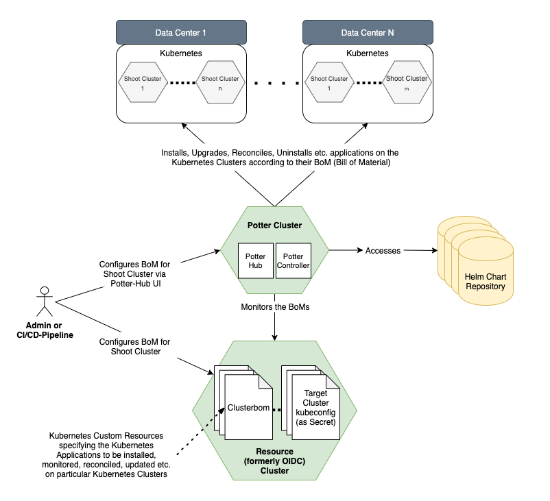

Welcome to the K8s Applications and Services Hub! Here, you can find everything you always wanted to know about the K8s 
Applications and Services Hub (or just 'AppHub'). As a first time visitor, you might want to first go through this document to get an overview over the K8s Applications and Services Hub. If you are looking for something specific, please see the navigation on the left hand side.

  > For information about Cluster-BoMs, visit the [Controller Docs](../../controller-docs/home).  

## What Is the K8s Applications and Services Hub?

The *K8s Applications and Services Hub*, shortly *Application Hub*, is a Kubernetes extension from SAP to deploy and manage deployments in Kubernetes clusters. It’s a central component in a Kubernetes landscape and doesn’t require any additional components running in the target shoot cluster. 
Target groups are primarily SAP teams who want to deploy Kubernetes workload in a Gardener-managed cluster.

## Benefits of using the K8s Applications and Services Hub

- Possibility to have **one single YAML file describing the full set of K8s Deployments for a cluster** instead of using individual Command Scripts for each K8s Deployment and also managing those deployments individually. Simply create a "Bill-of-Material" containing multiple k8s deployments using different deployment technologies like Helm, kapp or plain yaml (*planned*)
- **Establish a declarative approach for K8s deployments** (using Cluster-BoMs) as the standard for SAPs K8s Workloads to eliminate the need of creating specific deployment scripts to deploy K8s workload to Clusters, which quickly becomes unmanageable, especially in private cloud scenarios
- **No need to deal with Helm or kapp (as well as other k8s deployment technologies) in detail**. Instead, let the AppHub be responsible for handling these deployment technology details
- **Possibility to retrieve and use one single status** (the Cluster-BoM Status), representing the overall state of all deployments in a cluster, instead of trying to compute the overall cluster deployment state on your own
- **Dependency-Management between Cluster Deployments** (*planned*), where for example the sequence of K8s deployments can be specified, even between different K8s deployment technologies like Helm, kapp or plain YAML files
- **Import/Export Management between deployments** (*planned*), where specific data created during deployment of component A is needed during deployment of Component B
- **Cluster-BoMs represent the single source of truth** of what is actually running on a specific cluster, making it possible to provide deployment statistics across Gardener Projects ("What exactly runs on SAP-managed Clusters ?")

## Architecture Overview

## What can be deployed?

Supported Kubernetes deployments are currently based on [Helm](https://helm.sh/) charts and [kapp](https://github.com/k14s/kapp) applications, but other types will be supported in future. 

To trigger deployments, two approaches are available:
* [Manual deployments using the UI](./ui/)
* Automated deployments using Cluster-BoMs (see the [Controller Docs](../../controller-docs/home)). 

The Helm charts are located in dedicated Helm chart repositories. These repos must be connected to a potter-hub installation according to the installation guide.

### Contacts
If you have any questions about the AppHub, please don't hesitate to contact us via the following channels (in preferred order):

1. [AppHub Slack Channel](https://sap-cp.slack.com/app_redirect?channel=k8s-hub)
2. [Team DL](mailto:DL_5DD55C9CB52A299DF06071EA@global.corp.sap)

### Requirements Handling
If you have a requirement towards the AppHub, please get in contact with the Product Owner [Ingo Kober](mailto:ingo.kober@sap.com).

